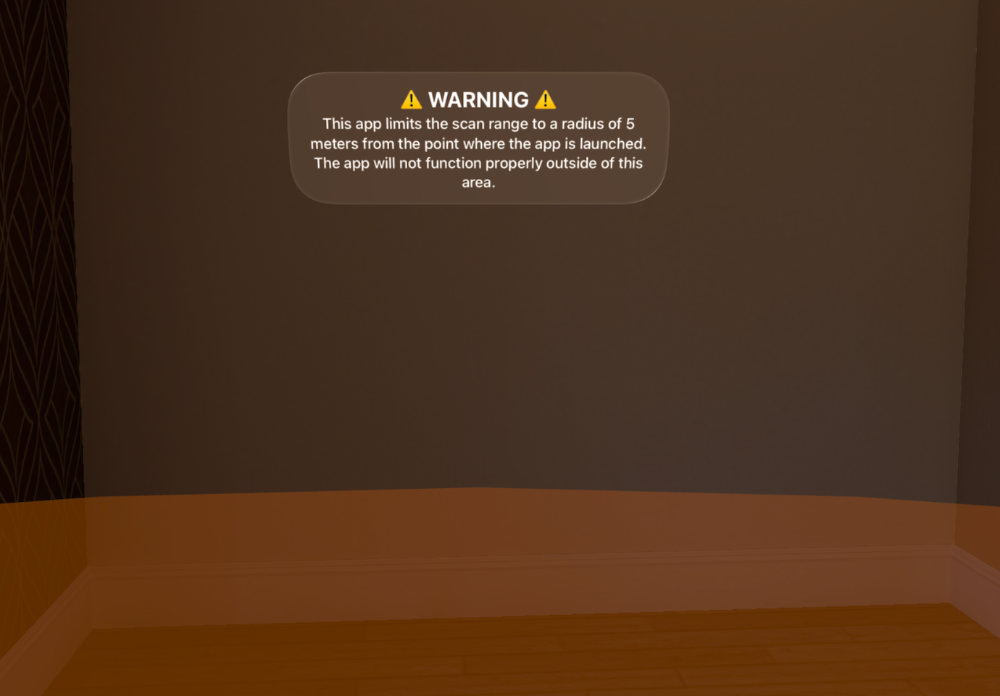

# FindSurface-RealityKit-visionOS

**Curv*Surf* FindSurface™ demo app for visionOS (Swift)**

## Overview

This demo app demonstrates a basic usage of [FindSurface-visionOS](https://github.com/CurvSurf/FindSurface-visionOS/tree/main) package to search vertex points (provided by ARKit as meshes) for geometry shapes.

## Requirements

This demo app runs on an Apple Vision Pro device only, and requires you permissions to track your hands and to scan your environment (world sensing) to operate as intended.

## How to use

After starting the app, the floating panels (below) will appear on your right side, and you will see wireframe meshes that approximately describe your environments. Performing a spatial tap (tapping your thumb and index finger together) with staring at a location on the meshes will invoke FindSurface, with an indicator (blue disk) appearing on the surface you've gazed.

### Controls window for parameters

This panels provide you ways to control the app's behavior and information about geometries you've found. With the panels, you can perform the following actions:

- Tap your right middle finger and thumb together will bring the panel near your hand.
- The button at the top right corner of the Controls window hides or shows the Results window.
- The button at the top right corner of the Results window hides all panels. You can bring them back with the gesture mentioned above.
- Shape icons: In order, they represent plane, sphere, cylinder, cone, and torus. Choose one of these to specify the type of shape to be found using FindSurface.
- You can click the text fields to modify values of the following three parameters. All numerical values representing length are in centimeters and are displayed to one decimal place (millimeters).
- `Accuracy` represents the *a priori* root-mean-squared error of vertices of meshes.
- `Avg. Distance` represents the average distance between the vertices.
- `Touch Radius` specifies the approximate radius of the region of interest (depending on the estimated size of the object to be detected). You can adjust this value by tapping the thumb and index finger of both hands together and moving your hands apart or closer.
- `Show inlier points` visualizes the set of points that contribute to the detection of the shape.
- `Show geometry outline` enhances the visibility of the shape by highlighting its outline.
- `Clear Scene` removes all detected shapes.

For detailed explanations of the parameters, please refer to [FindSurface](https://github.com/CurvSurf/FindSurface#how-does-it-work).

For the recommended preset of the parameters, please refer to [Optimal Parameter Set for Apple Vision Pro](https://github.com/CurvSurf/FindSurface-visionOS#optimal-parameter-set-for-apple-vision-pro). In this app, the preset values are already set as the defaults (See [AppStorage.swift](FindSurfaceST-visionOS/App/AppStorage.swift) file.)

#### Voice Control Supports (experimental)

Thanks to Apple's built-in accessibility supports in visionOS, it is possible to interact with some of UIs using voice commands.
> Using the voice control for this app is experimental. It may not work as intended because we haven't complete the implementations for this feature.

In order to enable this feature, follow the instructions below:
1. Go `Settings` in Apps screen.
2. Tap `Accessibility`, `Physical and Motor`, and `Voice Control`.
3. Enable `Voice Control`.
4. Enable `Play Sound` if you want to get sound feedbacks when the system reacts to voice commands.

Here is what you can do with voice commands in the app:
- Say "Tap" to perform the spatial tap without tapping your fingers together.
- Say the following commands to set your target feature to:
   - `Plane`: "Tap plane"
   - `Sphere`: "Tap sphere" or "Tap ball"
   - `Cylinder`: "Tap cylinder"
   - `Cone`: "Tap cone"
   - `Torus`: "Tap torus" or "Tap donut"
- Say the following commands to open dialog to edit parameter values of:
   - `Accuracy`: "Tap accuracy"
   - `Mean Distance`: "Tap average distance", "Tap mean distance", or "Tap distance"
   - `Seed Radius`: "Tap touch radius" or "Tap seed radius"
- Say the following commands to change the state of the toggle:
   - `Show Inlier Points`: "Tap inlier"
   - `Show Geometry Outline`: "Tap outline"
- Say "Tap Clear" to clear the scene.

You can see the names of UI controls that you can interact with using voice commands by saying "Show names". It will display the accessibility names of the views. Not all views having the names can interact using voice commands (i.e., `Lat.Ext.` and `Rad.Exp.`.) Say "Hide names" if you don't want to see the names.

### Results window

Whenever you invoke FindSurface and it succeeds, the information about the resulting geometry will be displayed in this window and in a small info panel floating near the geometry.

For simplicity, the information consists of numbers only, of which meaning can be interpreted as follows:

- Plane: width, height, (position), (normal), RMS error
- Sphere: radius, (position), RMS error
- Cylinder: radius, height, (position), (axis), RMS error
- Cone: top radius, bottom radius, height, (position), (axis), RMS error
- Torus: mean radius, tube radius, (position), (axis), angle, RMS error

* All lengths are in centimeter, including positions, except for directional vectors, in which units do not have meaning.
* Angle in torus is in degrees.

You can remove geometries separately by clicking the trash can button in the corner of the info panel.

### App Scanning Boundary

This app limits the scanning range to a radius of 5 meters from the origin, which is the ground location where the app starts.

During our tests, we found that there can be performance issues when `RealityKit` has to render an excessive number of mesh entities. FindSurface can detect and measure shapes without rendering the meshes as long as it gets point clouds as inputs. However, we render them as a visual feedback for users to indicate whether `SceneReconstructionProvider` has sufficiently scanned the surrounding environment. We think that as the number of the entities increases, `RealityKit` might have to take excessive time to handle the entities for mesh visualization, leading to stuttering and an unpleasant user experience.

For a smooth experience in our demo app, we exclude `MeshAnchor` data if the anchor's position is beyond a certain range from the origin. The excluded data is not rendered nor included in FindSurface's input point cloud. When users approaches within 1.5 meters of this boundary, an orange fence of 1 meter height will be visualized. Moreover, if they get within 75 cm, a small warning message appears at the top of their sight (see the image above). These mechanisms are intended to ensure this app's rendering performance and appropriate level of user experiences and NOT related to user safety, despite the term `safety` being used in the source code.

These specific ranges are defined by several variables, including `safetyDistance`, at the top of the `AppState.swift` file. In case you need to bypass this artificial limitation, you can change these values as needed or set them to very large numbers to effectively disable this feature.