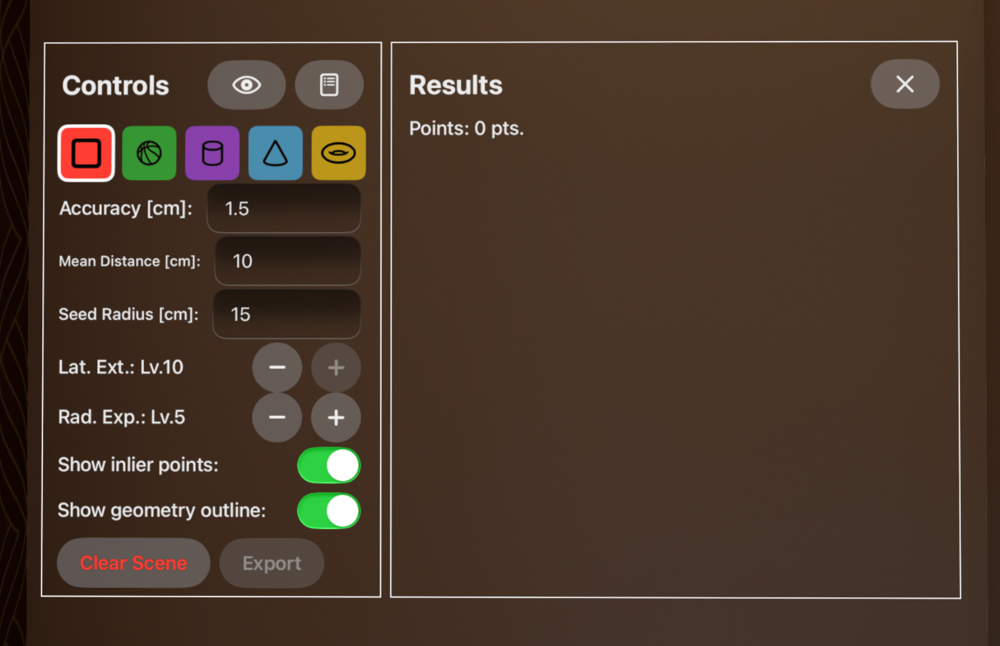

# FindSurface-RealityKit-visionOS

**Curv*Surf* FindSurface™ demo app for visionOS (Swift)**

## Overview

This demo app demonstrates a basic usage of [FindSurface-visionOS](https://github.com/CurvSurf/FindSurface-visionOS/tree/main) package to search vertex points (provided by ARKit as `MeshAnchor`s) for geometry shapes.

## Requirements

This demo app runs on an Apple Vision Pro device only, and requires you permissions to track your hands and to scan your environment (world sensing) to operate as intended.

## How to use

After starting the app, the floating panels (below) will appear on your right side, and you will see wireframe meshes that approximately describe your environments. Performing a spatial tap (tapping your thumb and index finger together) with staring at a location on the meshes will invoke FindSurface, with an indicator (blue disk) appearing on the surface you've gazed.

### Controls window for parameters

This panels provide you ways to control the app's behavior and information about geometries you've found. With the panels, you can perform the following actions:

- Tap your right middle finger and thumb together will bring the panel near your hand.
- The button at the top right corner of the Controls window hides or shows the Results window.
- The button at the top right corner of the Results window hides all panels. you can bring them back with the gesture mentioned above.
- Shape icons: In order, they represent plane, sphere, cylinder, cone, and torus. Choose one of these to specify the type of shape to be found using FindSurface.
- You can click the text fields to modify values of the following three parameters. All numerical values representing length are in centimeters and are displayed to one decimal place (millimeters).
- `Accuracy` represents the *a priori* root-mean-squared error of vertices of meshes.
- `Avg. Distance` represents the average distance between the vertices.
- `Touch Radius` specifies the approximate radius of the region of interest (depending on the estimated size of the object to be detected). You can adjust this value by tapping the thumb and index finger of both hands together and moving your hands apart or closer.
- `Show inlier points` visualizes the set of points that contribute to the detection of the shape.
- `Show geometry outline` enhances the visibility of the shape by highlighting its outline.
- `Clear Scene` removes all detected shapes.

For detailed explanations of the parameters, please refer to [FindSurface](https://github.com/CurvSurf/FindSurface#how-does-it-work).

#### Voice Control Supports (experimental)

Thanks to Apple's built-in accessibility supports in visionOS, it is possible to interact with some of UIs using voice commands.
> Using this app with the voice control is experimental. We haven't complete the implementations for 

### Results window

Whenever you invoke FindSurface and it succeeds, the information about the resulting geometry will be displayed in this window and in a small info panel floating near the geometry.

For simplicity, the information consists of numbers only, of which meaning can be interpreted as follows:

- Plane: width, height, (position), (normal), RMS error
- Sphere: radius, (position), RMS error
- Cylinder: radius, height, (position), (axis), RMS error
- Cone: top radius, bottom radius, height, (position), (axis), RMS error
- Torus: mean radius, tube radius, (position), (axis), angle, RMS error

* All lengths are in centimeter, including positions, except for directional vectors, in which units do not have meaning.
* Angle in torus is in degrees.

You can remove geometries separately by clicking the trash can button in the corner of the info panel.